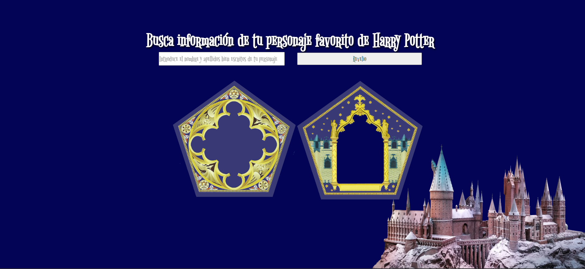

El proyecto es una página web que permite obtener información de los personajes de Harry Potter a través de una API externa.
La página incluye un formulario de búsqueda donde se puede introducir el nombre y apellidos del personaje, y al hacer clic en el botón "Revelio", se muestra la información del personaje, incluyendo su casa, patronus y una imagen.
La API externa utilizada proporciona datos sobre los personajes de Harry Potter, y se accede a ella a través de una solicitud fetch en un archivo JavaScript llamado data.js. Este archivo contiene una función llamada searchCharacter() que realiza la solicitud a la API y muestra la información del personaje en la página.
El proyecto incluye también un archivo HTML que estructura el contenido de la página, y un archivo CSS que define el estilo visual de la página.
Para utilizar el proyecto, simplemente abre el archivo HTML en un navegador web y utiliza el formulario de búsqueda para buscar información sobre los personajes de Harry Potter.
El proyecto es una herramienta útil para los fans de Harry Potter que deseen obtener información detallada sobre los personajes de la saga.
Para más detalles, consulta la documentación del proyecto.

Se puede consultar el diseño a través de este enlace: https://www.figma.com/file/DcYRBcbqvNoGiWTHyO80Km/Untitled?type=design&node-id=0%3A1&mode=design&t=dtmwiLqpuDZkwxLI-1
El diseño de ordenador sería el siguiente

El diseño de móvil sería el siguiente

